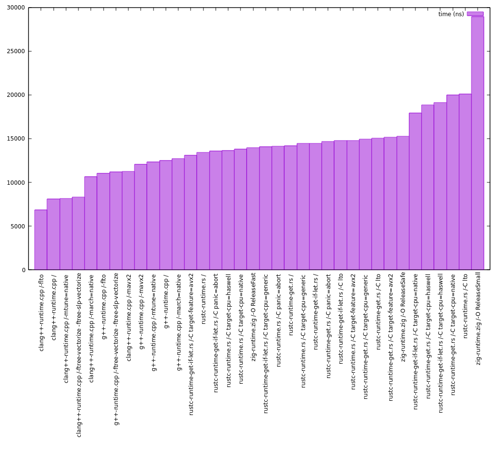

# General Matrix Multiplication benchmark
- This project tries to benchmark difference between several systems programming languages.
- `comptime` benchmarks runtime constrution of the final matrix computed at compile time.
- `runtime` benchmarks runtime computation of the final matrix computed at run time.

- Matrix is represented with 2 compile time constants for its size.

## Languages
- C++ (g++, clang++)
- Rust (rustc)
- C (gcc, clang)

## Compile time

## Runtime

